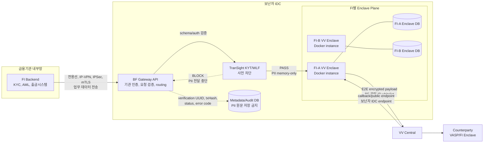
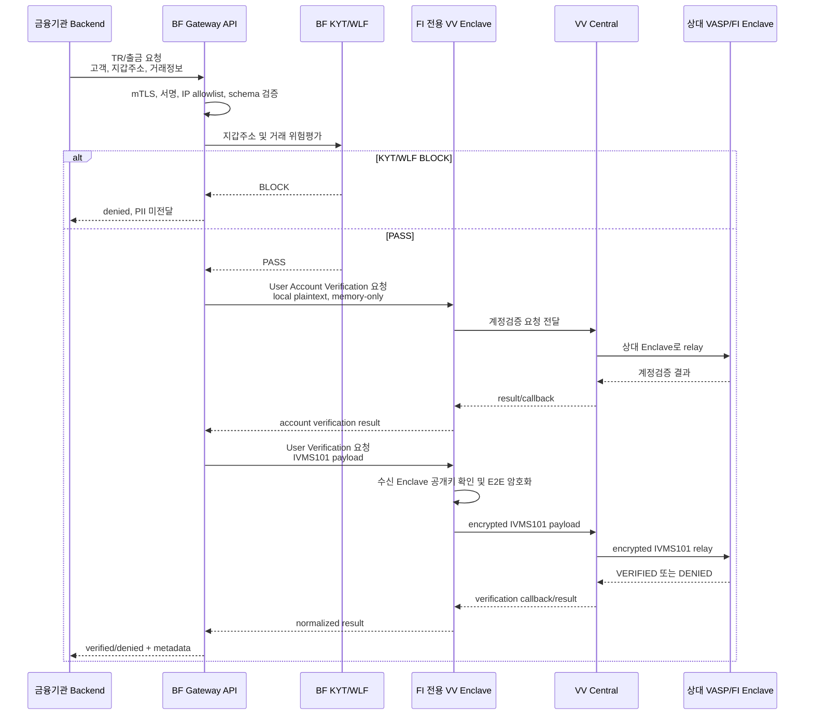
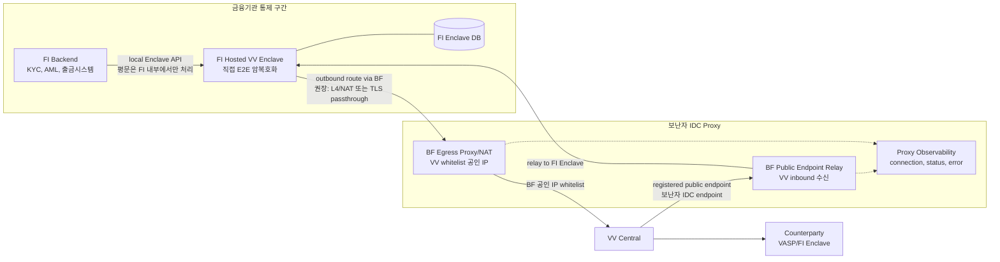
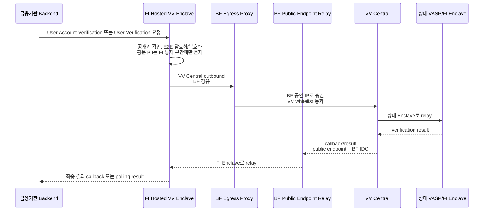
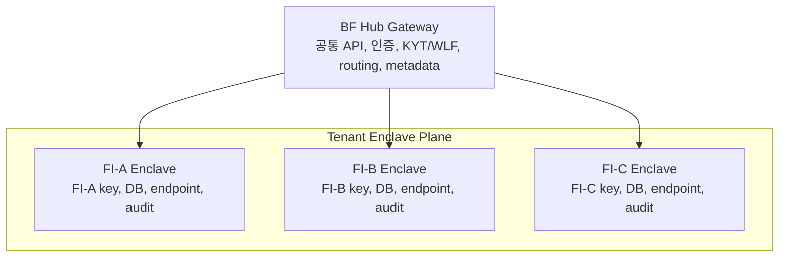

# VV Enclave 배치 옵션 1/2 설계 비교

> 2026-08-10 업데이트: VV의 no-BF-data-plane 피드백 이후 이 문서의 옵션1(BF IDC managed Enclave)과 옵션2(BF IDC Proxy)는 상용 기본안에서 제외하는 방향으로 재분류되었다. 새 기준안은 `FI DMZ-hosted VV Enclave + direct VV Central communication`이며, 자세한 내용은 [[AI-Sessions/wiki/decisions/2026-08-10-vv-no-bf-data-plane-pivot]]을 참조한다.

## 1. 결론

보난자팩토리의 VV 국내 구축 모델은 두 상품형으로 나누는 것이 가장 명확하다.

| 구분 | 옵션1 Gateway/Router | 옵션2 Proxy |
|---|---|---|
| 핵심 구조 | 금융기관은 보난자 Gateway API만 연동하고, 보난자 IDC가 FI별 VV Enclave를 운영 | 금융기관이 VV Enclave를 직접 설치하고, 보난자 IDC는 VV Central 연결 프록시만 제공 |
| Enclave 위치 | 보난자 IDC | 금융기관 내부망, DMZ, 또는 금융기관 통제 구간 |
| 평문 PII 경계 | 금융기관 -> 보난자 암호화 채널 이후, 보난자 IDC의 통제 구간에서 E2E 직전 일시 처리 | 금융기관 내부 Enclave에서만 처리. 보난자는 원칙적으로 평문 PII 비열람 |
| 금융기관 개발 부담 | 낮음. 기존 VAN 연동과 유사한 Gateway API 연동 | 높음. VV Enclave 설치, VASP API 구현, 내부 시스템 연동 필요 |
| 보난자 개발 부담 | 높음. Gateway API, orchestration, FI별 tenant 운영 필요 | 중간. 네트워크 프록시, public endpoint relay, egress 통제 중심 |
| 주 대상 | Docker/해외 SaaS/망분리 이슈로 직접 VV 도입이 어려운 은행, 금융기관 | 기술 수용성이 높고 VV 표준 구조를 직접 들일 수 있는 금융기관 |
| 권고 | 1차 상용 기본안 | 보조안, 고수용 금융기관용 |

운영 기본값은 옵션1이되, 옵션1에서도 **단일 Hub Enclave가 아니라 금융기관별 전용 Enclave Docker instance**를 띄우는 구조가 맞다. 하나의 Enclave가 여러 금융기관을 공유하는 모델은 VV의 VASP/FI identity, key pair, DB, audit, whitelist 경계와 충돌할 가능성이 높다.

## 2. enclave_API.docx 재확인 요지

`enclave_API.docx` 기준으로 확인한 핵심은 다음과 같다.

1. VV Enclave는 closed-source Docker image로 배포되며, 운영주체가 수정할 수 있는 범위는 환경변수와 외부 연동 설정으로 제한된다.
2. Enclave는 단순 암호화 라이브러리가 아니라 VASP/FI identity, key pair, public key exchange, VV Central 통신, Enclave DB, callback 처리의 trust boundary다.
3. API는 크게 Enclave API 9종과 VASP API 5종으로 나뉜다.
4. `User Verification`의 IVMS101 payload는 수신 Enclave의 공개키로 E2E 암호화되어 VV Central이 복호화하지 못한다.
5. `User Account Verification`은 문서 예시상 local Enclave 호출 구간에서 평문 payload가 확인되므로, Gateway 모델에서는 개인정보 처리 통제가 필요하다.
6. Enclave의 `public endpoint`는 양 옵션 모두 보난자 IDC endpoint로 등록할 수 있다.
7. Enclave -> VV Central outbound는 VV 화이트리스트 체계상 보난자 Gateway의 공인 IP를 "해당 Enclave의 IP"로 등록해야 한다.
8. 옵션1에서는 금융기관이 VV raw API를 직접 호출하지 않으므로, 보난자가 별도 Gateway API를 만들고 내부에서 VV API orchestration을 수행해야 한다.
9. 옵션1 멀티테넌시는 FI별 Enclave instance, FI별 key material, FI별 outbound IP 또는 최소한 FI별 credential/endpoint/DB/key 분리가 필요하다.

## 3. 공통 네트워크 전제

두 옵션 모두 아래 공통 조건을 가진다.

| 항목 | 공통 설계 |
|---|---|
| Inbound, VV Central -> Enclave | Enclave 환경변수의 public endpoint를 보난자 IDC endpoint로 등록 |
| Outbound, Enclave -> VV Central | VV에는 보난자 Gateway 공인 IP를 해당 Enclave의 IP로 whitelist 등록 |
| 금융기관 내부망 직접 해외 통신 | 금지 또는 회피 |
| 해외 SaaS 직접 사용 | 금융기관이 직접 쓰는 구조가 아니라 보난자 국내 통제 구간을 통과 |
| 감사 증적 | 보난자가 channel auth, routing, KYT/WLF, verification UUID, txHash, status, error code, 처리시각을 보관 |
| 원문 PII 저장 | 옵션1에서도 원칙적으로 금지. 로그, 큐, 운영 화면, 파일에 원문 저장 금지 |

가능하면 FI별 outbound public IP를 분리한다. 비용이나 네트워크 구조상 shared BF egress IP를 써야 하면, VV와 금융기관에 "IP는 BF managed egress이고 tenant identity는 credential, endpoint, DB, key, audit partition으로 분리한다"고 명시해야 한다.

## 4. 옵션1: Gateway/Router, BF Managed Enclave

### 4.1 정의

금융기관은 VV Enclave Docker를 내부에 설치하지 않는다. 금융기관은 기존 VAN 연동과 유사하게 보난자 IDC Gateway API로 필요한 출금, 수취인 검증, 트래블룰 요청 정보를 전송한다. 보난자는 금융기관별 전용 VV Enclave를 IDC에서 운영하고, 해당 Enclave가 E2E 암호화/복호화 및 VV Central 통신을 수행한다.

이 모델에서 보난자는 개인정보 처리 수탁자 또는 이에 준하는 처리자 지위를 전제로 삼아야 한다. 정확한 설명은 "보난자는 평문 PII를 전혀 보지 않는다"가 아니라 "보난자는 금융기관과의 위수탁 및 보안통제 하에 E2E 암호화 직전 필요한 최소 시간 동안만 평문을 일시 처리하고, 원문을 저장하지 않는다"이다.

### 4.2 아키텍처 다이어그램



### 4.3 시퀀스 다이어그램



### 4.4 옵션1에서 보난자가 제공해야 하는 자체 API

옵션1에서는 금융기관이 VV API를 직접 알 필요가 없어야 한다. 보난자가 아래와 같은 단순화 API를 제공하고, 내부에서 VV Enclave API 9종과 VASP API 5종을 orchestration한다.

| BF Gateway API 예시 | 내부 처리 |
|---|---|
| `POST /v1/tr/account-check` | VV User Account Verification 호출 |
| `POST /v1/tr/verifications` | KYT/WLF 후 VV User Verification 호출 |
| `GET /v1/tr/verifications/{id}` | VV Verification Result 조회 및 BF metadata 조회 |
| `POST /v1/tr/transactions/{id}/result` | VV Transaction Result Report 호출 |
| `GET /v1/tr/vasps` | VV VASP List 조회, 캐시, 필터링 |
| `POST /v1/tr/callbacks/{tenant}` | VV callback을 BF 표준 callback으로 변환 |

### 4.5 옵션1 운영 원칙

1. 금융기관별 Enclave Docker instance를 분리한다.
2. 금융기관별 Enclave DB 또는 schema를 분리한다.
3. 금융기관별 `VEGA_ALLIANCE_ACCESS_KEY`, secret, DB encryption key, authorization token을 분리한다.
4. 금융기관별 public endpoint subdomain 또는 path를 분리한다.
5. 금융기관별 audit partition, retention policy, rate limit, SLA를 분리한다.
6. PII 원문은 memory-only로 처리하고 body log, queue, cache, 운영화면 노출을 금지한다.
7. 장애 재처리가 필요하면 원문 PII queue를 만들지 말고 금융기관 원천 시스템 재요청 방식 또는 짧은 TTL의 tenant KMS envelope encryption을 별도 승인 하에 사용한다.
8. KYT/WLF BLOCK이면 Enclave로 PII를 넘기지 않는다.

### 4.6 옵션1 장점과 리스크

| 항목 | 내용 |
|---|---|
| 장점 | 은행, 금융기관이 Docker Enclave를 내부에 설치하지 않아도 된다. 기존 VAN 연동 수준으로 도입 가능하다. 망분리와 해외 SaaS 직접 통신 이슈를 보난자가 흡수한다. |
| 리스크 | 보난자가 평문 PII를 일시 처리하는 개인정보 수탁자가 된다. FI별 Enclave isolation, 로그 통제, 운영자 접근통제, DPA, 감사권 설계가 필수다. |
| 적합 대상 | 추가 대응개발에 거부감이 크고, 내부망에 외부 Docker나 해외 SaaS 통신을 들이기 어려운 은행, 전자금융업자, 보수적 금융기관 |

## 5. 옵션2: Proxy, FI Hosted Enclave

### 5.1 정의

금융기관이 VV Enclave를 직접 설치하고, 금융기관 내부 또는 DMZ에서 직접 E2E 암호화/복호화를 수행한다. 보난자 IDC는 VV Central과의 통신 경로, public endpoint relay, outbound egress allowlist, 관측성, 장애 대응을 제공하는 Proxy 역할을 한다.

이 모델은 기존 VV Travel Rule 구조를 가장 그대로 유지한다. 다만 금융기관 내부망에서 해외 VV Central로 직접 나가지 않고, 보난자 IDC Proxy를 통과한다.

### 5.2 아키텍처 다이어그램



### 5.3 시퀀스 다이어그램



### 5.4 옵션2 Proxy 통제 방식

옵션2의 장점은 보난자가 평문 PII를 보지 않는 구조를 유지할 수 있다는 점이다. 이를 지키려면 Proxy는 기본적으로 L4/TCP passthrough, NAT, 전용회선 relay, 또는 TLS passthrough를 우선 검토한다.

L7 reverse proxy를 사용할 수도 있지만, 그 경우 보난자 Proxy가 HTTP payload를 볼 수 있는 지점이 생긴다. 이때는 request/response body log 금지, TLS termination 범위, Account Verification payload 노출 가능성, 인증서 위임, 책임 경계를 별도로 문서화해야 한다. "옵션2는 보난자가 평문 PII를 보지 않는다"는 설명을 유지하려면 L7 종단은 신중하게 써야 한다.

### 5.5 옵션2 장점과 리스크

| 항목 | 내용 |
|---|---|
| 장점 | VV의 원래 구조에 가장 가깝다. E2E 암복호화와 평문 처리가 금융기관 통제 구간에 남는다. 보난자의 개인정보 처리 부담이 작다. |
| 리스크 | 금융기관이 Docker Enclave, Enclave DB, VASP API, callback, 키관리, 이미지 검증, 운영보안 심사를 직접 수행해야 한다. 추가 개발과 내부 보안심사 부담이 크다. |
| 적합 대상 | 기술 대응력이 있고, VV 구조를 직접 수용할 수 있으며, 보난자에는 망분리 대응용 Proxy만 요구하는 금융기관 |

## 6. 옵션1과 옵션2 비교 판단

| 판단축 | 옵션1 Gateway/Router | 옵션2 Proxy |
|---|---|---|
| 금융기관 설치 난이도 | 낮음 | 높음 |
| 금융기관 망분리 대응 | 보난자가 대부분 흡수 | FI 내부에서 Enclave 설치 후 BF Proxy로 우회 |
| 개인정보 처리자 | 보난자가 일시 처리자/수탁자 | 주로 금융기관 내부 처리 |
| VV 원형 유지 | 중간. BF Gateway API로 추상화 | 높음 |
| 보난자 상품성 | 높음. Gateway 사업 가치가 큼 | 중간. 네트워크/운영 대행 가치 |
| 확장성 병목 | FI별 Enclave provisioning, IP whitelist, secrets 자동화 | FI별 설치/보안심사 속도 |
| 감사 대응 | 보난자가 통합 감사 패키지 제공 | FI와 보난자 책임 분리 설명 필요 |
| 추천 포지션 | 기본 상용안 | 대안 또는 고수용 기관용 |

## 7. Enclave 수량에 대한 결론

옵션1에서 핵심은 "Hub Enclave 1개"가 아니라 "Hub Gateway 1개 + FI별 Enclave 여러 개"다.



단일 Hub Enclave는 PoC, 데모, 내부 실험에는 가능하지만 상용 금융기관용 기본 구조로 두기 어렵다. VV가 공식적으로 multi-tenant Enclave, multiple VASP/FI identity, tenant별 key/DB/log isolation을 지원한다고 확인해주기 전까지는 FI별 Enclave instance 분리를 기준으로 설계한다.

## 8. VV에 확인해야 할 항목

1. 보난자가 공식 파트너로서 여러 FI를 대신해 다수 Enclave instance를 운영하는 partner-hosted model을 허용하는가.
2. FI별 `VEGA_ALLIANCE_ACCESS_KEY`, secret, VASP/FI ID, membership identity를 발급할 수 있는가.
3. 금융기관이 VASP가 아닌 경우 VV network identity를 어떻게 표현하는가.
4. FI별 outbound public IP가 필수인가, 아니면 shared BF egress IP와 FI별 credential/endpoint/key 분리를 허용하는가.
5. Enclave의 VV Central 접속 검증이 도메인 기반 표준 TLS인가, IP/인증서 pinning인가.
6. `public endpoint`를 보난자 subdomain 또는 path로 등록하는 것을 공식 지원하는가.
7. 옵션2에서 BF가 L4/TLS passthrough relay를 제공할 때 VV Central callback과 Enclave 인증서 구성이 문제 없는가.
8. User Account Verification payload의 보호 수준과 Central 구간 암호화 여부를 공식 확인할 수 있는가.
9. Enclave image의 source review, image signing, SBOM, vulnerability scan, update freeze, rollback 절차를 어떤 형태로 제공할 수 있는가.

## 9. 제안 포지셔닝 문구

금융기관 대상 설명은 다음처럼 잡는 것이 안전하다.

```text
보난자는 VerifyVASP 공식 국내 구축 파트너로서 금융기관이 해외 VV Central이나 폐쇄형 Docker Enclave를 직접 내부망에 수용하지 않아도 되는 국내 Gateway/Proxy 구조를 제공합니다.

기본형은 보난자 IDC에서 금융기관별 전용 VV Enclave를 운영하는 Managed Gateway 방식입니다. 금융기관은 기존 VAN 연동 수준의 보안 채널로 필요한 트래블룰 정보를 전달하고, 보난자는 개인정보 처리 위수탁 및 통제 하에 원문을 저장하지 않고 E2E 암호화 직전의 최소 처리만 수행합니다.

고수용 기관은 자체 구간에 VV Enclave를 직접 설치하고, 보난자는 망분리 대응을 위한 Public Endpoint Relay와 VV Central Egress Proxy만 제공하는 Proxy 방식을 선택할 수 있습니다.
```

## 10. 다음 산출물

1. 옵션1 기준 BF Gateway API 상세 스펙
2. FI별 Enclave provisioning runbook
3. FI-BF 개인정보 처리 위수탁 및 보안통제 체크리스트
4. VV 확인 질문지 및 기술 미팅 agenda
5. 옵션2 L4/TLS passthrough proxy reference architecture
6. 은행 보안심사용 네트워크, 키관리, 로그, 운영자 접근통제 패키지
