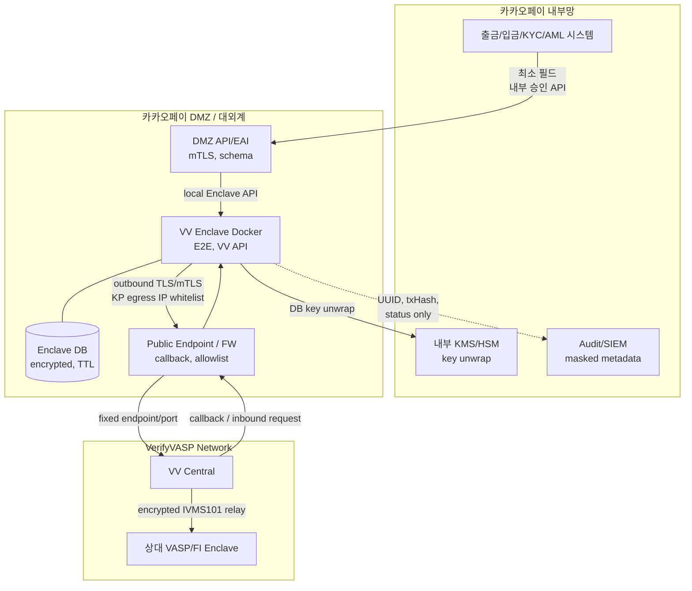
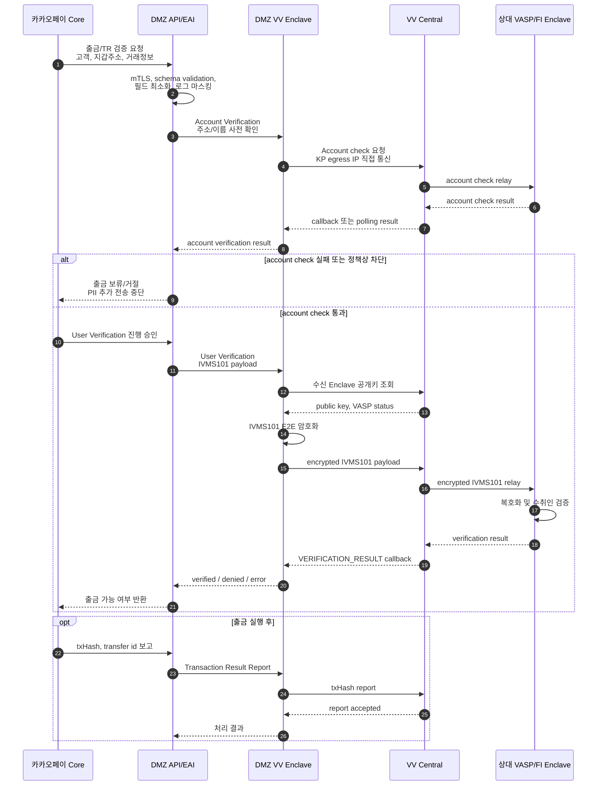

# 카카오페이-VV DMZ 직접 연동 구조

## 목적

카카오페이가 금융기관/FI 역할로 VerifyVASP(VV)를 직접 연동하는 경우의 기준 구조다. 핵심은 `카카오페이 DMZ 내 VV Enclave 설치`와 `VV Central 직접 통신`이다.

이 구조는 제3자 IDC Gateway/Proxy 모델이 아니라, 카카오페이 통제 구간 안에 VV Enclave를 배치하는 방식이다. 외부 사업자는 필요한 경우 기술자문만 수행하며, TR payload의 중계, 저장, 관제, 운영접근 주체가 되지 않는다.

## 전제

1. 카카오페이 내부망 업무시스템은 VV Central 또는 해외 SaaS와 직접 통신하지 않는다.
2. VV Enclave Docker는 카카오페이 DMZ 또는 대외계 보안구간에 설치한다.
3. Enclave의 `public endpoint`는 카카오페이 DMZ endpoint로 VV Central에 등록한다.
4. Enclave outbound는 카카오페이 공인 egress IP를 VV에 whitelist 등록하고, VV Central의 고정 endpoint/port만 허용한다.
5. 외부 기술자문자는 TR payload 또는 평문 PII를 중계, 저장, 처리하지 않는다.
6. DMZ에는 원문 PII body log를 남기지 않는다. Enclave DB가 필요하면 암호화, TTL, 접근통제, 내부 KMS/HSM 연계를 적용한다.

## 아키텍처 구조도



## 시퀀스 다이어그램

아래 흐름은 카카오페이가 송신기관(OFI)으로 출금을 처리하면서 수취 VASP/FI에 Travel Rule 검증을 수행하는 기준 시나리오다.



## 규제 설명 포인트

이 구조는 `카카오페이가 해외 SaaS를 내부망에서 직접 호출하는 구조`가 아니라, `카카오페이 DMZ 대외계 구간에 설치된 전문처리 시스템이 특정 VV Central endpoint와 통신하는 구조`로 설명한다.

외부 설명 문구는 다음처럼 잡는 것이 좋다.

```text
카카오페이 통제 구간의 DMZ/대외계 영역에 VV Enclave를 설치하고,
해당 Enclave가 Travel Rule/AML 목적의 표준화된 전문을 특정 VV Central endpoint와 직접 송수신한다.
외부 기술자문자는 구조 검토와 구축 자문만 수행하며,
Travel Rule 개인정보 payload의 중계자, 처리자, 운영자가 되지 않는다.
```

## 확인 필요 항목

1. 카카오페이가 VV Enclave를 DMZ 내 Docker/Kubernetes 또는 VM에 설치할 수 있는지.
2. DMZ에 Enclave DB를 둘 수 있는지, 또는 DB/key/log는 내부 보호구간으로 분리해야 하는지.
3. VV Central endpoint, port, outbound IP whitelist, callback public endpoint 등록 방식.
4. `User Account Verification`의 평문 처리 구간과 로그 금지/마스킹 통제.
5. `User Verification`의 E2E 암호화 범위와 public key 교환 방식.
6. 외부 기술자문 범위를 문서 검토/구축 자문으로 제한하고, 운영접근이 필요한 경우 별도 승인 대상으로 둘지 여부.
