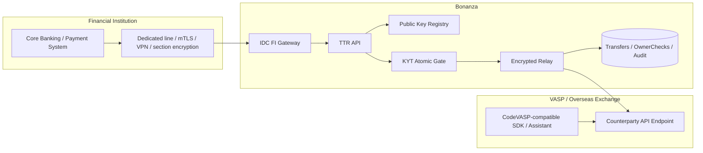
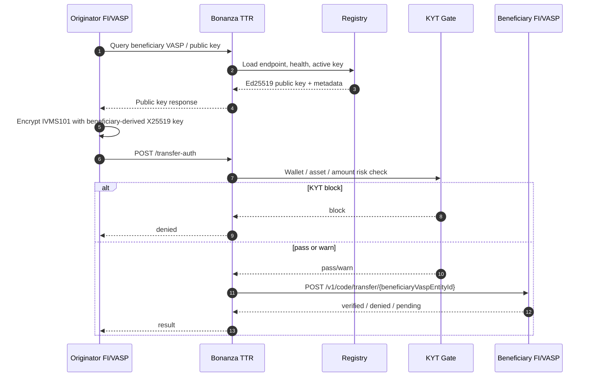

# TTR CodeVASP Core Redesign Plan

## 1. Executive Summary

Bonanza TTR은 기존의 “여러 Travel Rule 네트워크를 모두 adapter로 붙이는 hub” 방향에서, CodeVASP 구조를 기본 토대로 한 Bonanza-operated Travel Rule Gateway로 재설계한다.

핵심은 세 가지다.

1. Bonanza가 연결 VASP의 public key를 저장, 관리, 반환한다.
2. 송신 금융기관/VASP는 수신 VASP public key로 IVMS101 또는 OwnerCheck payload를 암호화한다.
3. Bonanza는 암호화 payload를 relay하고, 거래 metadata, status, audit, 운영 routing을 관리한다.

금융기관은 Bonanza의 VAN/전자금융보조업자 인프라, IDC 서버, 전용성 회선, 구간 암호화, mTLS, VPN/IPsec 등 기존 금융기관 연동 방식을 활용할 수 있다. 비금융 VASP와 해외 사업자는 cloud API 또는 npm 기반 CodeVASP-compatible integration assistant를 통해 연동한다.

## 2. Decisions

| Area | Decision |
| --- | --- |
| Core protocol | CodeVASP-compatible Travel Rule relay |
| Default alliance | `bonanza` |
| Registry role | Bonanza가 VASP endpoint, channel, public key, capability를 관리 |
| Public key | Base64 Ed25519 verify key를 canonical key로 저장 |
| Encryption | Ed25519 key에서 X25519/Curve25519 key를 derive |
| Payload | IVMS101 encrypted payload relay |
| Financial institution channel | IDC ingress, VAN-like integration, dedicated line, mTLS, VPN/IPsec 가능 |
| Non-financial VASP channel | Cloud API, API docs, npm/assistant integration |
| Other TR networks | GTR, Sumsub, VerifyVASP adapter는 core path에서 제외 |
| OwnerCheck | 새 Bonanza extension으로 구현 |

## 3. Target Architecture



## 4. Travel Rule Flow



## 5. Public Key Policy

CodeVASP GitHub 자료 기준 해석:

```text
canonical stored key = Ed25519 VerifyKey / Public Key
signature verification = Ed25519 public key 그대로 사용
payload encryption = Ed25519 public key를 Curve25519/X25519 public key로 derive
payload decryption = Ed25519 signing private key를 Curve25519/X25519 private key로 derive
```

Bonanza Registry 정책:

```text
public_keys.algorithm = Ed25519
public_keys.key_purpose = both | signing | encryption
public_keys.metadata.encryptionDerivation = ed25519_to_x25519
public_keys.metadata.encryptionSuite = X25519-XSalsa20-Poly1305
```

## 6. OwnerCheck

OwnerCheck는 VV VerifyName에 대응되는 Bonanza의 Identical Account Owner Verification 기능이다. 엄밀히는 Travel Rule 본문 검증이 아니라, 동일 계정주 여부를 사전 확인하는 enhanced risk mitigation 수단이다.

기존 CodeVASP/TTR에는 “Travel Rule Authorization 내부에서 수신 VASP가 이름과 DOB를 비교하는 절차”와 “주소 검증 API”는 있었지만, 독립 호출 가능한 동일 계정주 확인 서비스는 없었다. 따라서 OwnerCheck는 새 기능으로 만든다.

API namespace:

```http
POST /owner-check
POST /owner-check/{beneficiaryVaspEntityId}
```

외부 공개 API를 `/v1`로 감싸는 경우:

```http
POST /v1/owner-check/{beneficiaryVaspEntityId}
```

`/v1/code/*` 아래에는 두지 않는다. CodeVASP compatibility를 깨지 않기 위해서다.

OwnerCheck v1 비교 정책:

- 이름은 CodeVASP 기본 규칙을 따른다.
- case-insensitive 비교
- whitespace 제거
- surname/given name 분리값 우선
- first+last와 last+first 모두 비교
- `nameIdentifier` 우선, `localNameIdentifier` fallback
- DOB는 기본적으로 필수 일치로 둔다.
- 국내 VASP별 세부 정책 차이는 VASP `metadata` 또는 요청 `policy`에 둔다.

## 7. Implementation Changes Applied

이번 redesign 기준으로 코드에 반영한 변경:

- `supabase/functions/_shared/protocol-adapter.ts`
  - GTR/Sumsub/VerifyVASP adapter path를 core에서 비활성화
  - Bonanza/CodeVASP-compatible relay 중심으로 재작성
  - `routeOwnerCheck` 추가
- `supabase/functions/transfer-auth/index.ts`
  - `beneficiaryVaspEntityId` 필수화
  - 활성 public key 없으면 `VASP_KEY_NOT_FOUND`
  - 수취 VASP 미지정 자동 승인 제거
  - `pending`을 `verified`로 바꾸던 매핑 제거
  - KYT block 시 PII relay 중단 유지
- `supabase/functions/vasp-registry/index.ts`
  - default alliance를 `bonanza`로 변경
  - `GET /vasp-registry/pubkey/{vaspEntityId}` 추가
  - public key response에 encryption derivation metadata 포함
  - legacy `address-verify`를 OwnerCheck로 대체
- `supabase/functions/owner-check/index.ts`
  - 신규 OwnerCheck Edge Function 추가
  - 요청 저장, beneficiary key 확인, relay, 결과 저장
- `supabase/migrations/20260821000000_codevasp_core_redesign.sql`
  - `public_keys`에 `key_purpose`, `kid`, `version`, `metadata` 추가
  - `owner_checks` 테이블 추가
- `src/types/code-api.ts`, `src/types/vasp.ts`, `src/types/transfer.ts`
  - 새 public key, pending, OwnerCheck 타입 반영

## 8. Remaining Work

필수 후속 작업:

- 실제 CodeVASP-compatible Ed25519 signing header 구현 검증
- outbound relay의 canonical JSON serialization 확정
- OwnerCheck payload schema 확정
- 금융기관용 IDC ingress와 cloud API의 인증 정책 분리
- npm integration assistant 설계
- VASP별 name/DOB comparison policy profile 정의
- Edge Function 통합 테스트 추가

보류:

- VerifyVASP 직접 adapter
- GTR adapter
- Sumsub adapter
- 다른 Travel Rule network bridge

## 9. Operational Positioning

Bonanza가 지속적으로 계약할 수 있는 역할은 단순 SI가 아니라 운영형 gateway/provider다.

- 금융기관용 보안 접속 구간 제공
- VASP public key directory 운영
- routing, health, status, audit 운영
- key rotation과 endpoint 변경 관리
- OwnerCheck, KYT, Travel Rule relay를 하나의 운영 SLA로 제공
- 국내 금융기관 정보보호/망분리 요구에 맞춘 IDC 또는 전용 인프라 운영

이 포지션은 “VV 또는 특정 해외 SaaS를 대신 설치해주는 업체”가 아니라, 국내 금융기관이 사용할 수 있는 Travel Rule Gateway와 public-key trust infrastructure를 운영하는 사업자라는 명분을 갖는다.
