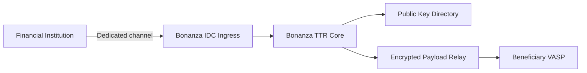

# Financial Institution Channels

Financial institutions often cannot install overseas SaaS components or VASP-side Docker services directly inside their network. Bonanza TTR provides Travel Rule capabilities through domestic IDC ingress and VAN-style operating infrastructure.

## Why It Matters

| Requirement | Bonanza TTR Response |
|-------------|----------------------|
| Network separation | Approved connectivity between the institution and Bonanza IDC |
| External SaaS restrictions | Domestic gateway endpoint instead of direct overseas endpoint |
| Privacy controls | Contracted processing, access control, log masking, retention rules |
| Security review | mTLS, VPN/IPsec, dedicated line, and IP allowlist profiles |
| Operations | Endpoint, key rotation, incident response, SLA monitoring |

## Supported Channels

| Channel | Use Case | Description |
| --- | --- | --- |
| HTTPS | General VASPs, sandbox | TLS plus request signing |
| mTLS | Fintechs, internet banks | Mutual certificate authentication |
| VPN/IPsec | Conservative institutions | Encrypted tunnel with network controls |
| Leased Line | Banks, VAN-style integrations | Dedicated connectivity similar to financial VAN operations |
| IDC Ingress | Financial institutions | Domestic ingress server for institution traffic |

## Data Flow

## Design Rules

- The financial-institution to Bonanza segment follows contract, security-channel, and privacy-processing controls.
- Bonanza operates the beneficiary public-key directory and relay.
- IVMS101 payloads sent to beneficiary VASPs are encrypted for the beneficiary public key.
- Financial-institution channels and cloud VASP APIs use the same core contract.

## Operating Role

Bonanza's role is an operating gateway, not a one-time SI project.

- Endpoint and public-key lifecycle management
- Routing health and incident response
- Transfer and OwnerCheck status management
- Audit logs and SLA operations
- Financial-institution channel operations
