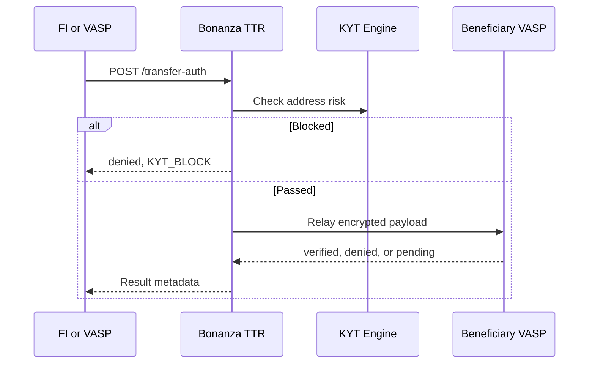

# Atomic KYT Gate

Bonanza TTR can prevent Travel Rule payload relay until the KYT result is determined.

## Modes

| Mode | Description | Relay behavior |
|------|-------------|----------------|
| `none` | Travel Rule only | Always relay |
| `kyt_only` | KYT lookup only | No Travel Rule relay |
| `atomic` | KYT and Travel Rule as one gate | Relay or deny by policy |

## Atomic Flow

## VASP Settings

| Setting | Values | Description |
|---------|--------|-------------|
| `kyt_mode` | `none`, `kyt_only`, `atomic` | KYT operating mode. |
| `kyt_scope` | `tr_only`, `all` | Whether KYT applies only to TR transfers or all transfers. |
| `kyt_auto_block` | `true`, `false` | Auto-deny when block policy matches. |
| `kyt_return_for_sar` | `true`, `false` | Include risk metadata for reporting workflows. |

## Failure Policy

Each institution can choose fail-open or fail-close by contract and internal control policy.

| Failure | Fail-open | Fail-close |
|---------|-----------|------------|
| KYT timeout | Relay with warning metadata | Deny with `KYT_TIMEOUT` |
| KYT service error | Relay with warning metadata | Deny with `KYT_SERVICE_ERROR` |
| Misconfiguration | Deny by default | Deny by default |

For financial-institution channels, fail-close is the recommended default. The final policy should follow the institution's risk standard and SLA.
