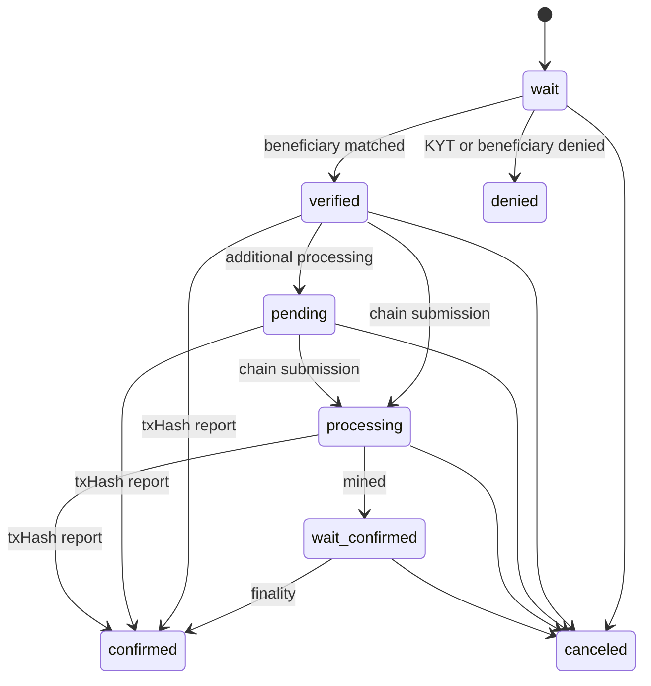

# State Machine

Transfer state changes according to relay results and on-chain progress.

## Diagram

## Statuses

| Status | Terminal | Description |
|--------|----------|-------------|
| `wait` | No | Transfer created and waiting for KYT or beneficiary response. |
| `verified` | No | Beneficiary authorized the Travel Rule request. |
| `denied` | Yes | KYT, routing, or beneficiary policy denied the request. |
| `pending` | No | Additional IVMS101, manual, or operational processing is in progress. |
| `processing` | No | On-chain submission is in progress. |
| `wait-confirmed` | No | Transaction is recorded but finality is not complete. |
| `confirmed` | Yes | txHash was reported and the transfer is complete. |
| `canceled` | Yes | Transfer was canceled before completion. |

## Product Rules

- `pending` is not an approval state.
- `denied` and `canceled` are normally terminal.
- Changes after `confirmed` require a separate operational correction process and audit evidence.
- OwnerCheck has a separate state machine and does not automatically change Transfer state.
