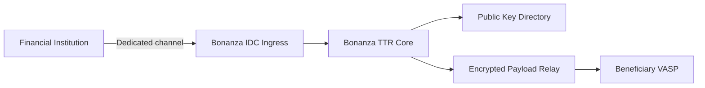

# 금융기관 채널

금융기관은 해외 SaaS나 VASP 내부 Docker 구성요소를 직접 붙이기 어렵습니다. Bonanza TTR은 국내 IDC ingress와 기존 VAN형 운영 인프라를 통해 Travel Rule 기능을 제공합니다.

## Why It Matters

| Requirement | Bonanza TTR Response |
|-------------|----------------------|
| 망분리 | 금융기관과 Bonanza IDC 사이의 승인된 접속 구간 제공 |
| 외부 SaaS 직접통신 제한 | 해외 endpoint 대신 국내 gateway endpoint 사용 |
| 개인정보 처리 통제 | 위수탁, 접근권한, 로그 masking, 보관기간을 계약으로 분리 |
| 보안심사 | mTLS, VPN/IPsec, 전용회선, IP allowlist profile 제공 |
| 운영책임 | endpoint, key rotation, 장애 대응, SLA monitoring |

## Supported Channels

| Channel | Use Case | Description |
| --- | --- | --- |
| HTTPS | 일반 VASP, sandbox | TLS plus request signing |
| mTLS | 핀테크, 인터넷전문은행 | 기관 인증서 기반 상호 인증 |
| VPN/IPsec | 보수적인 금융기관 | 암호화 tunnel과 network control |
| Leased Line | 은행, VAN형 연동 | 기존 금융 VAN 수준의 전용성 접속 |
| IDC Ingress | 금융기관 공통 | 국내 IDC에 금융기관 접속 서버 배치 |

## Data Flow

## Design Rules

- 금융기관과 Bonanza 사이의 구간은 별도 계약, 보안채널, 개인정보 처리 통제로 관리합니다.
- Bonanza는 수신 VASP public key directory와 relay 운영을 담당합니다.
- 수신 VASP로 전달되는 IVMS101 payload는 수신 VASP public key로 암호화합니다.
- 금융기관 채널과 cloud VASP API는 같은 core contract를 사용합니다.

## Operating Role

Bonanza의 역할은 1회성 SI가 아니라 지속 운영 gateway입니다.

- endpoint와 public key lifecycle 관리
- routing health와 장애 대응
- transfer와 OwnerCheck 상태 관리
- audit log와 SLA 운영
- 금융기관 접속 채널 운영
