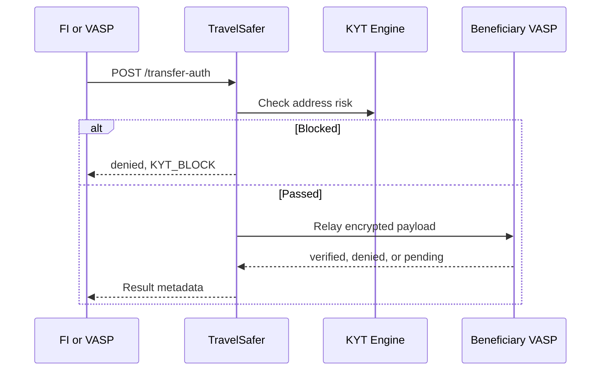

# Atomic KYT Gate

TravelSafer은 KYT 결과가 확정되기 전에 Travel Rule payload를 외부 VASP로 relay하지 않도록 구성할 수 있습니다.

## Modes

| Mode | Description | Relay behavior |
|------|-------------|----------------|
| `none` | KYT 없이 Travel Rule만 수행 | 항상 relay |
| `kyt_only` | KYT만 조회 | Travel Rule relay 없음 |
| `atomic` | KYT와 Travel Rule을 하나의 gate로 처리 | 정책에 따라 relay 또는 deny |

## Atomic Flow

## VASP Settings

| Setting | Values | Description |
|---------|--------|-------------|
| `kyt_mode` | `none`, `kyt_only`, `atomic` | KYT operating mode. |
| `kyt_scope` | `tr_only`, `all` | Whether KYT applies only to TR transfers or all transfers. |
| `kyt_auto_block` | `true`, `false` | Auto-deny when block policy matches. |
| `kyt_return_for_sar` | `true`, `false` | Include risk metadata for reporting workflows. |

## Failure Policy

기관별 계약과 내부통제에 따라 fail-open 또는 fail-close를 선택합니다.

| Failure | Fail-open | Fail-close |
|---------|-----------|------------|
| KYT timeout | Relay with warning metadata | Deny with `KYT_TIMEOUT` |
| KYT service error | Relay with warning metadata | Deny with `KYT_SERVICE_ERROR` |
| Misconfiguration | Deny by default | Deny by default |

금융기관 채널은 보수적으로 fail-close를 기본 제안으로 둡니다. 실제 운영 정책은 기관의 리스크 기준과 SLA에 따라 확정합니다.
