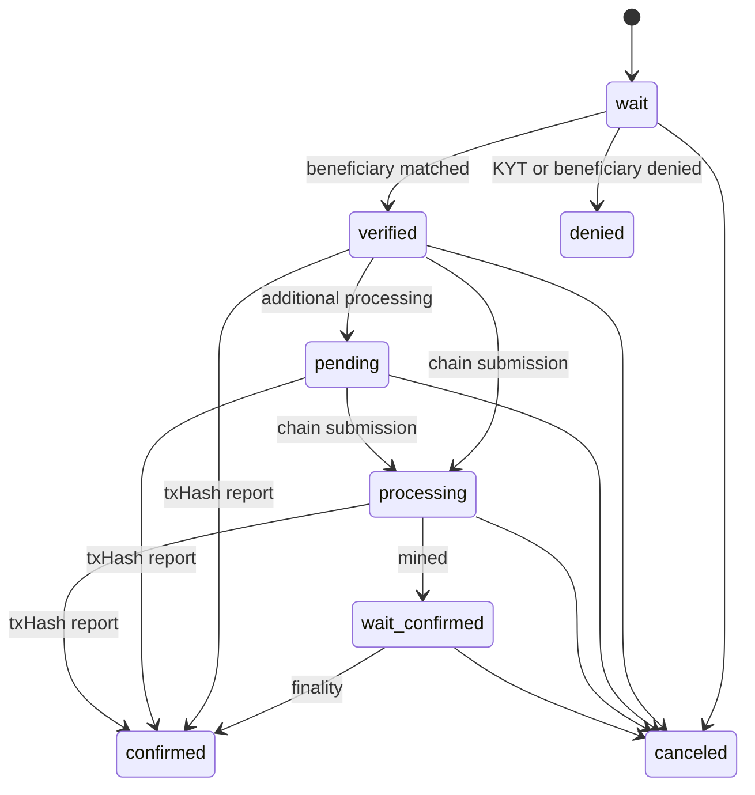

# State Machine

Transfer는 relay 결과와 온체인 진행 상황에 따라 상태가 바뀝니다.

## Diagram

## Statuses

| Status | Terminal | Description |
|--------|----------|-------------|
| `wait` | No | Transfer created and waiting for KYT or beneficiary response. |
| `verified` | No | Beneficiary authorized the Travel Rule request. |
| `denied` | Yes | KYT, routing, or beneficiary policy denied the request. |
| `pending` | No | Additional IVMS101, manual, or operational processing is in progress. |
| `processing` | No | On-chain submission is in progress. |
| `wait-confirmed` | No | Transaction is recorded but finality is not complete. |
| `confirmed` | Yes | txHash was reported and the transfer is complete. |
| `canceled` | Yes | Transfer was canceled before completion. |

## Product Rules

- `pending`은 승인 완료 상태가 아닙니다.
- `denied`와 `canceled`는 일반적으로 terminal입니다.
- `confirmed` 이후 변경은 chain reorg, 운영 정정, 감사 근거가 있는 경우에만 별도 절차로 처리합니다.
- OwnerCheck는 별도 상태 머신을 사용하며 Transfer 상태를 자동으로 변경하지 않습니다.
