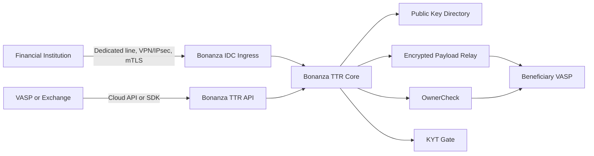

# TTR 전략

## 결론

Bonanza TTR은 "여러 해외 Travel Rule provider를 중계하는 adapter hub"가 아니라, CodeVASP 구조를 토대로 한 Bonanza 운영형 Travel Rule Gateway로 간다.

핵심 역할은 세 가지입니다.

1. VASP public key directory를 운영한다.
2. 수신 VASP public key로 암호화된 Travel Rule payload를 relay한다.
3. 금융기관이 쓰기 쉬운 국내 IDC/VAN형 접속 채널을 제공한다.

## Product Position

| Customer | Primary Integration | Value |
|----------|---------------------|-------|
| 은행, 전자금융업자 | Bonanza IDC 채널 | 내부망, 망분리, 보안심사 부담을 줄인 Travel Rule 도입 |
| 국내 VASP | CodeVASP-compatible API 또는 SDK | 기존 TR pipeline을 크게 바꾸지 않고 public key relay 참여 |
| 해외 VASP | Cloud API 또는 edge node | 한국 금융기관 및 국내 VASP와의 송수신 대응 |
| 비의무 VASP | OwnerCheck 중심의 제한 연동 | 동일 계정주 검증 등 enhanced risk mitigation |

## Architecture Direction

## Business Rationale

금융기관은 해외 SaaS나 VASP형 Docker 구성요소를 직접 내부망에 넣기 어렵습니다. Bonanza는 기존 VAN/전자금융보조업자 경험을 바탕으로 다음 근거를 제공합니다.

| Role | Rationale |
|------|-----------|
| Connectivity operator | 금융기관 전용성 채널, 운영 monitoring, 장애 대응 |
| Public key directory operator | VASP별 public key와 endpoint의 lifecycle 관리 |
| Compliance gateway | KYT Gate, audit metadata, 처리상태 evidence 제공 |
| Integration partner | 금융기관, VASP, 해외 사업자별 접속 방식 차이를 흡수 |

## Scope Exclusions

| Exclusion | Reason |
|-----------|--------|
| GTR/Sumsub/VerifyVASP adapter 중심 전략 | core 구조를 복잡하게 만들고 법적/운영상 책임 경계가 흐려짐 |
| CodeVASP namespace 변경 | 기존 사용기관의 compatibility를 깨지 않음 |
| OwnerCheck를 Travel Rule 본 검증으로 포장 | 목적과 규제 근거가 다르므로 별도 extension으로 운영 |
| 모든 기관의 name/DOB 비교 정책 단일화 | 국내 VASP별 KYC 데이터와 normalization 정책 차이를 인정 |

## Roadmap

| Phase | Goal | Output |
|-------|------|--------|
| 1 | Core relay 정리 | Registry, public key, transfer-auth, OwnerCheck |
| 2 | 금융기관 채널 | IDC ingress, mTLS/VPN profile, audit pack |
| 3 | VASP onboarding | SDK/assistant, API docs, sandbox |
| 4 | OwnerCheck 고도화 | name/DOB policy matrix, hash/PSI option 검토 |
| 5 | Optional rails | 외부 provider adapter는 명확한 법적 근거와 고객 수요가 있을 때만 재검토 |
