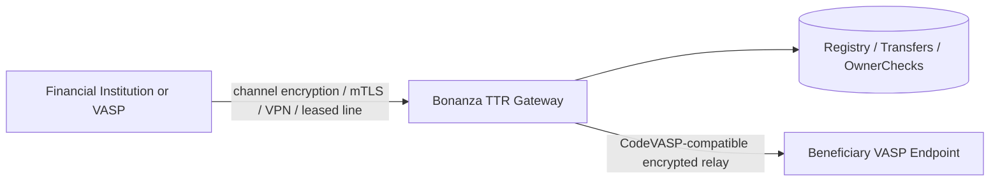
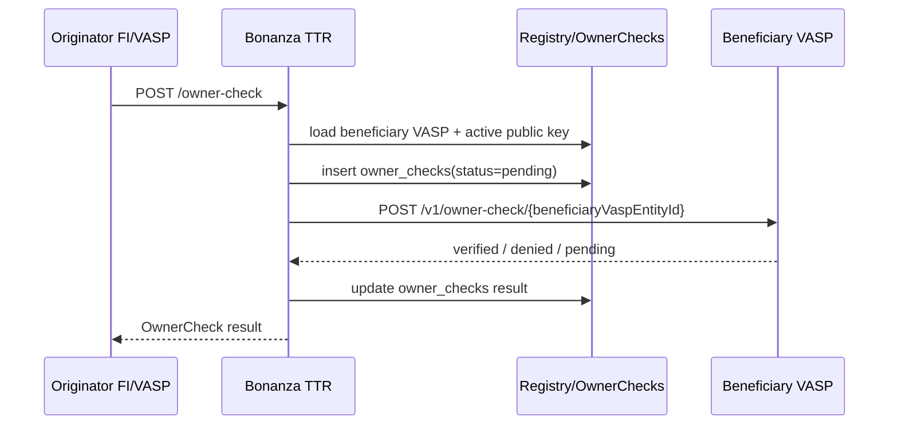

# Bonanza TTR API Specification

Version: 2.0.0  
Last updated: 2026-08-21  
Base URL: `https://{SUPABASE_PROJECT_REF}.supabase.co/functions/v1`

## 1. Architecture

Bonanza TTR is a CodeVASP-compatible Travel Rule gateway with a Bonanza-managed public-key registry and a Bonanza extension for identical account-owner verification.



Key rules:

- Registry public key is Base64 Ed25519.
- Payload encryption derives X25519/Curve25519 from the Ed25519 key.
- Travel Rule payloads are encrypted by the originator for the beneficiary.
- Bonanza stores routing and audit metadata, not plaintext IVMS101 PII.
- `OwnerCheck` is a Bonanza extension and is not placed under `/v1/code/*`.

## 2. Endpoints

| Method | Endpoint | Purpose |
| --- | --- | --- |
| `GET` | `/health` | Health check |
| `GET` | `/vasp-registry` | List VASPs |
| `GET` | `/vasp-registry?id={vaspEntityId}` | Get one VASP with keys |
| `GET` | `/vasp-registry/pubkey/{vaspEntityId}` | Get active public keys |
| `POST` | `/vasp-registry` | Register VASP and initial public key |
| `PUT` | `/vasp-registry` | Update VASP metadata, endpoint, channel, health |
| `DELETE` | `/vasp-registry?id={vaspEntityId}` | Delete VASP |
| `POST` | `/vasp-registry/rotate-key` | Rotate public key |
| `POST` | `/transfer-auth` | Outgoing Travel Rule authorization relay |
| `POST` | `/transfer-auth/incoming` | Incoming encrypted Travel Rule receipt |
| `GET` | `/transfer-auth?id={transferId}` | Transfer lookup |
| `POST` | `/transfer-auth/result` | Report TXID |
| `POST` | `/transfer-auth/finish` | Cancel transfer |
| `POST` | `/owner-check` | OwnerCheck relay |
| `POST` | `/owner-check/{beneficiaryVaspEntityId}` | OwnerCheck relay with path target |
| `GET` | `/owner-check?id={ownerCheckId}` | OwnerCheck lookup |

Deprecated:

- `POST /vasp-registry/address-verify` returns `ADDRESS_VERIFY_REPLACED`.

## 3. Public Key Registry

### Register VASP

`POST /vasp-registry`

```json
{
  "vasp_entity_id": "kakaopay",
  "vasp_name": "KakaoPay",
  "vasp_legal_name": "Kakao Pay Corp.",
  "country_of_registration": "KR",
  "alliance_name": "bonanza",
  "endpoint_url": "https://example.com/ttr",
  "channel_type": "mTLS",
  "public_key": "BASE64_ED25519_VERIFY_KEY",
  "public_key_expires_at": null,
  "key_purpose": "both",
  "kid": "kp-2026-01",
  "metadata": {
    "deployment": "idc"
  }
}
```

Important fields:

| Field | Required | Notes |
| --- | --- | --- |
| `vasp_entity_id` | yes | Stable routing id |
| `endpoint_url` | yes | Counterparty API base URL |
| `public_key` | yes | Base64 Ed25519 verify key |
| `key_purpose` | no | `both`, `signing`, or `encryption`; default `both` |
| `alliance_name` | no | Default `bonanza`; `code` and `code-compatible` are accepted |

### Public Key Search

`GET /vasp-registry/pubkey/{vaspEntityId}`

```json
{
  "vaspEntityId": "kakaopay",
  "vaspName": "KakaoPay",
  "allianceName": "bonanza",
  "health": "up",
  "keys": [
    {
      "pubkey": "BASE64_ED25519_VERIFY_KEY",
      "algorithm": "Ed25519",
      "keyPurpose": "both",
      "encryptionDerivation": "ed25519_to_x25519",
      "encryptionSuite": "X25519-XSalsa20-Poly1305",
      "kid": "kp-2026-01",
      "version": 1,
      "expiresAt": null,
      "isActive": true
    }
  ]
}
```

## 4. Transfer Authorization

### Outgoing Relay

`POST /transfer-auth`

```json
{
  "transferId": "550e8400-e29b-41d4-a716-446655440000",
  "currency": "BTC",
  "amount": "0.01",
  "tradePrice": "1500000",
  "tradeCurrency": "KRW",
  "isExceedingThreshold": true,
  "address": "bc1q...",
  "network": "bitcoin",
  "originatorVaspEntityId": "bank-a",
  "beneficiaryVaspEntityId": "kakaopay",
  "payload": "ENCRYPTED_IVMS101_BASE64"
}
```

Processing:

1. Reject duplicated `transferId`.
2. Require `beneficiaryVaspEntityId`.
3. Load beneficiary VASP and active non-expired encryption-capable public key.
4. Run KYT atomic gate.
5. If KYT blocks, store denied transfer and do not relay PII.
6. If KYT passes or warns, relay encrypted payload to the beneficiary endpoint.
7. Store adapter result as `verified`, `pending`, or `denied`.

Response:

```json
{
  "result": "pending",
  "transferId": "550e8400-e29b-41d4-a716-446655440000",
  "beneficiaryVasp": {
    "vaspEntityId": "kakaopay",
    "vaspName": "KakaoPay"
  },
  "kyt": {
    "decision": "pass",
    "riskScore": 12
  },
  "adapter": {
    "protocol": "bonanza",
    "latencyMs": 132
  }
}
```

### Incoming Receipt

`POST /transfer-auth/incoming`

```json
{
  "transferId": "550e8400-e29b-41d4-a716-446655440000",
  "currency": "BTC",
  "amount": "0.01",
  "originatorVaspEntityId": "exchange-a",
  "beneficiaryVaspEntityId": "bank-a",
  "payload": "ENCRYPTED_IVMS101_BASE64"
}
```

Incoming transfers are stored as `pending` and queued in `ttl_queue` for matching/beneficiary verification.

### Result Report

`POST /transfer-auth/result`

```json
{
  "transferId": "550e8400-e29b-41d4-a716-446655440000",
  "txid": "0x...",
  "vout": "0"
}
```

Allowed pre-report statuses: `wait`, `verified`, `pending`, `processing`, `wait-confirmed`.

## 5. OwnerCheck

OwnerCheck is Bonanza's identical account-owner verification service. It supports enhanced risk mitigation for counterparties where full Travel Rule due diligence is not available or where a same-owner check is required before proceeding.

Endpoint:

- `POST /owner-check`
- `POST /owner-check/{beneficiaryVaspEntityId}`

Request:

```json
{
  "ownerCheckId": "oc-20260821-0001",
  "currency": "XRP",
  "address": "r...",
  "tag": "12345",
  "network": "xrp",
  "originatorVaspEntityId": "bank-a",
  "beneficiaryVaspEntityId": "exchange-b",
  "payload": "ENCRYPTED_OWNER_CHECK_PAYLOAD_BASE64",
  "policy": {
    "requireDobMatch": true,
    "nameMatchingPolicy": "normalized-exact"
  }
}
```

Policy baseline:

- Name comparison baseline:
  - case-insensitive
  - whitespace-insensitive
  - compare surname/given-name separated forms where available
  - compare first+last and last+first
  - use local-name fields as fallback
- DOB match is required by default in Bonanza OwnerCheck v1 unless the beneficiary policy explicitly allows another rule.
- VASP-specific comparison differences should be represented in `policy` or VASP `metadata`, not hard-coded into the common relay.

Sequence:



## 6. Status Values

Transfer statuses:

| Status | Meaning |
| --- | --- |
| `wait` | Created before relay result |
| `verified` | Counterparty verified |
| `denied` | Counterparty or KYT denied |
| `pending` | Waiting for beneficiary/manual/async result |
| `processing` | Blockchain transfer processing |
| `wait-confirmed` | Waiting for finality |
| `confirmed` | TXID reported and transfer confirmed |
| `canceled` | User/system canceled before completion |

Terminal statuses:

- `denied`
- `confirmed`
- `canceled`

OwnerCheck statuses:

| Status | Meaning |
| --- | --- |
| `pending` | Waiting for beneficiary response |
| `verified` | Same-owner check matched |
| `denied` | Same-owner check failed or was declined |
| `expired` | No response within TTL |
| `failed` | Routing or system error |

## 7. Error Codes

| Code | Meaning |
| --- | --- |
| `INVALID_REQUEST` | Required field missing or malformed |
| `VASP_NOT_FOUND` | Counterparty VASP is not registered |
| `VASP_HEALTH_DOWN` | Counterparty is registered but unavailable |
| `VASP_KEY_NOT_FOUND` | No active non-expired encryption-capable public key |
| `TRANSFER_DUPLICATE` | Duplicate transfer id |
| `OWNER_CHECK_DUPLICATE` | Duplicate OwnerCheck id |
| `KYT_BLOCK` | KYT atomic gate blocked relay |
| `RELAY_ERROR` | Counterparty relay failed |
| `ADDRESS_VERIFY_REPLACED` | Legacy address verification replaced by OwnerCheck |

## 8. Environment Variables

| Variable | Purpose |
| --- | --- |
| `SUPABASE_URL` | Supabase project URL |
| `SUPABASE_SERVICE_ROLE_KEY` | Service role key for Edge Functions |
| `BONANZA_HUB_VASP_ENTITY_ID` | Bonanza hub VASP id used in outbound relay |
| `BONANZA_ALLIANCE_PREFIX` | Header namespace, default `bonanza` |
| `BONANZA_TTR_CALLBACK_BASE_URL` | Public callback base for async result callbacks |
| `BONANZA_TTR_DEFAULT_ENDPOINT` | Optional fallback endpoint base |
| `BONANZA_SIGNING_PRIVATE_KEY` | Signing key material for CodeVASP-compatible outbound calls |
| `BONANZA_SIGNING_PUBLIC_KEY` | Public signing key for outbound headers |

Legacy aliases still recognized:

- `TRANSIGHT_VASP_ENTITY_ID`
- `CODE_API_BASE_URL`
- `CODE_API_PRIVATE_KEY`
- `CODE_API_PUBLIC_KEY`
